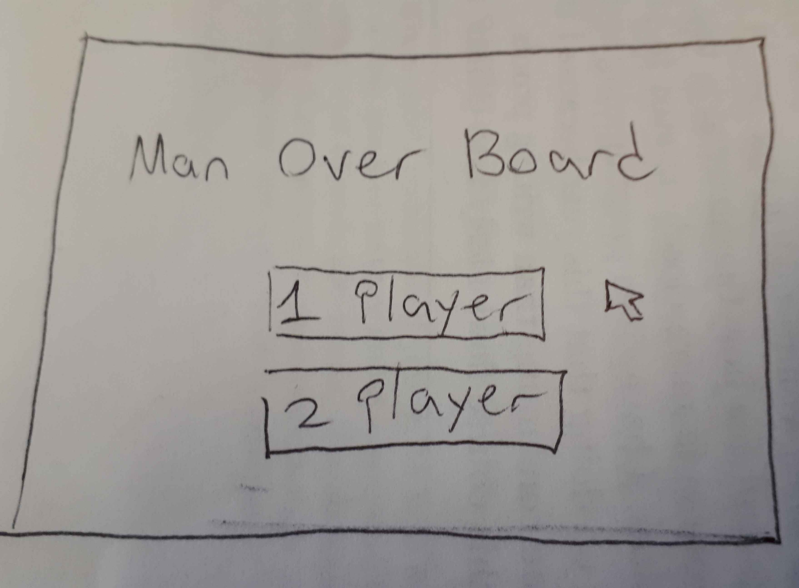
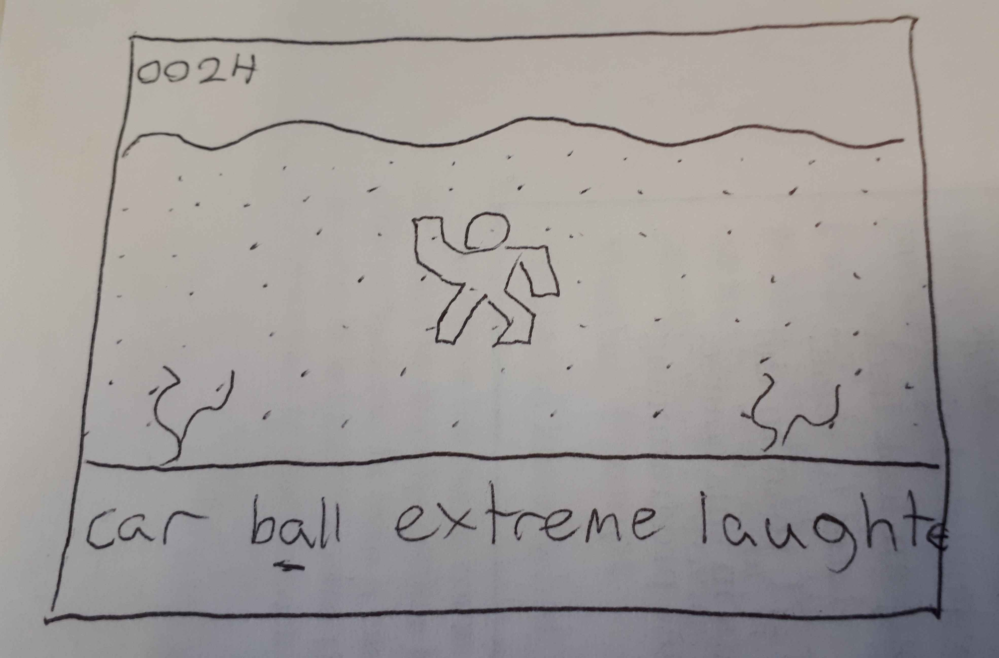
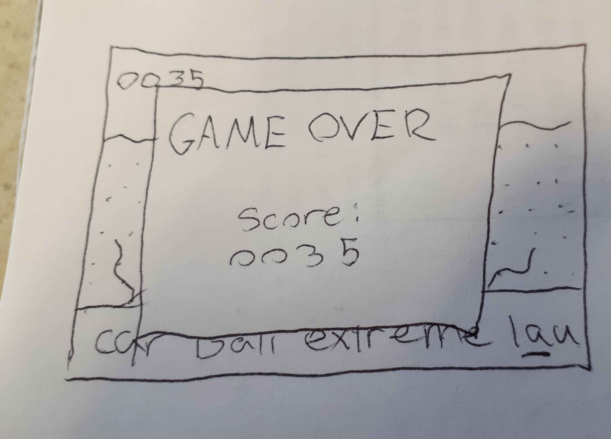
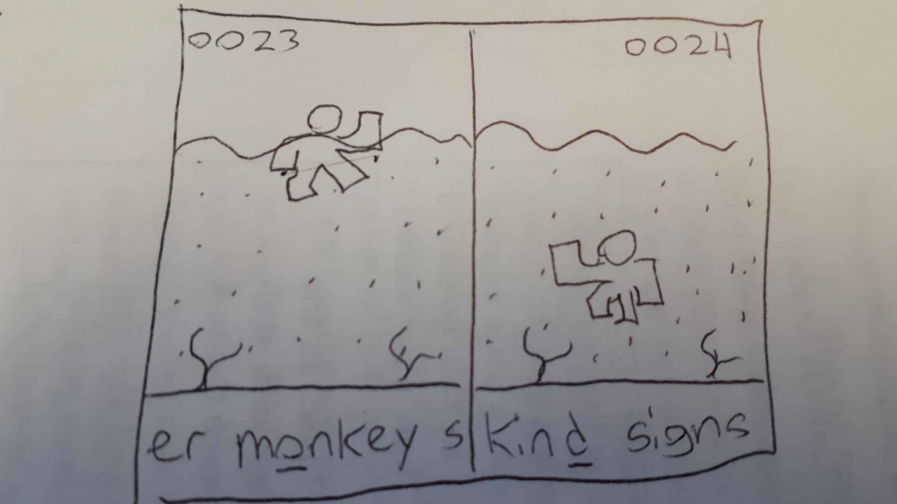

# Man Over Board: Game Proposal

## General Game Overview

The game appears to be a cross-section view of a small sea, with the surface
and the floor of the sea spanning left-to-right across the screen. The player
character will be constantly sinking to the bottom of the sea, and they will
lose if the player stays below the surface for too long; this will be indicated
to the player using a oxygen meter on the left hand side of the screen. To add
upward momentum to the character the player must correctly type the text appearing
on bottom of the screen. The game continues indefinitely until the player loses.

## Game Play Details for Core 1-Player Version

### Opening Screen

The initial splash screen shows the game title. Buttons labeled as "1 Player"
and "2 Player" appear once the game setup is complete. The player must select
one of these modes with the mouse or keyboard. **This is the only time that input from the
mouse will be required, as the main game only requires keyboard input**.

### Gameplay

- As soon as the "1 Player" mode is selected, the game display will appear and
  the game will start.
- The game display will consist of (from top-to-bottom): the score (a number
  in the upper corner), the surface of the water (a squggled line across the
  screen), the swimmer (the player character), the sea floor (a straight line
  across the screen, with sea grass sticking out of the top), and the row of
  words.
- The player character will begin at its maximum permitted height (with its
  head poking up through the waves) before immediately sinking.
- For the entirety of the game, the player character will sink at a consistent
  speed towards the sea floor. The game ends when the swimmer touches the sea
  floor.
- The player must correctly type a string of words displayed at the bottom of
  their screen in order to keep the swimmer from drowning. Every time a correct
  letter is typed, the swimmer bobs upward a set amount.
- The next letter to type will be indicated by the pointer (a line below the
  letter). When the correct letter is typed, the pointer will progress to the
  right. When all the letters in the row have been typed, the pointer will move
  to the far left of the screen, and a new row of words will appear. If the last
  word of the previous row was cut off midway, it will continue in the next row.
- The words will be selected randomly from a set of ~200 stored within the game.
- When a correct letter is typed, the score will increase.
- When the game ends, the gameplay will freeze and a display window somewhat
  smaller than the screen will appear in front. The text "Game Over" will be
  displayed in the window, and the player's score will be displayed below that.

### Game Objects

- Swimmer (Player Character, controlled by keyboard letters)
- Letters (Displayed in a row at the bottom of the screen)
- Pointer (Line below a particular letter, indicates the correct input to
  control the swimmer)

See the "Additional Features" section for more objects that may be added.

### Game Events

## Game Play Details for Core 2-Player Version

The two player version of the game will be extended version of the base
game--pivoting from pve to pvp. Where the two players would compete to
which can stay afloat for the longest.

The screen will be simply split in half with a character and UI on both
the lhs and rhs of the screen.

## Sound Effects

- A splash sound plays every time the swimmer bobs its head above the water.
- An ascending "bwoop" noise plays when a correct key is pressed and the
  swimmer bobs upward.
- A few descending notes play when the player loses.
- A few ascending notes play if the player wins (2 player version only).
- Background music: An original composition with basic synthesized notes.

## Additional Features

If there is time during development, additional features will be added:

1. Instead of sinking at a consistent speed, the swimmer's vertical movements
   will have inertia (sinking will increase in speed as more time passes without a
   push upwards, and if correct letters are typed in quick succession, the player
   will bob upward with increasing height).
2. Instead of the game ending when the swimmer touches the sea floor, there
   will be an air mechanic. A meter in the upper corner across from the score will
   show how much air the swimmer has left. It will decrease steadily while the
   swimmer's head is below water, and increase twice as fast when the swimmer's
   head is above water.
3. The difficulty of the game will increase at a steady pace. This either
   means that the swimmer will sink faster, or that the air will decrease faster.
   The speed of the background song will increase as the game difficulty increases.
4. Additional animations will be added to pre-existing elements: the water
   surface's waves will move instead of it appearing as a static line, the sea
   grass on the sea floor will move, the swimmer will have a particular animation
   for when they swim up, and the swimmer's neutral animation will become more
   frantic as the difficulty increases.
5. New game object: Fish will be added as decoration, and will move across
   the screen left-to-right in the water.
6. The game over will feature an animation depicting the swimmer's demise
   before the display window appears.
